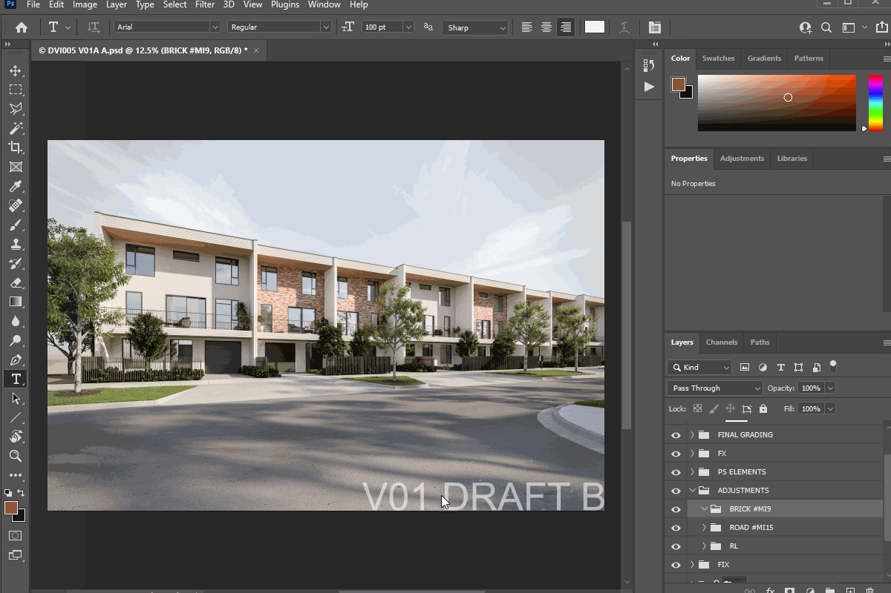
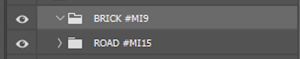
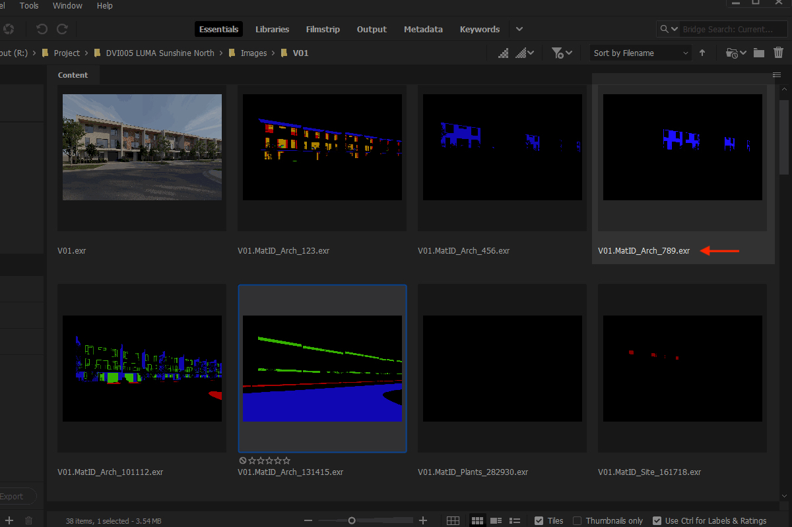
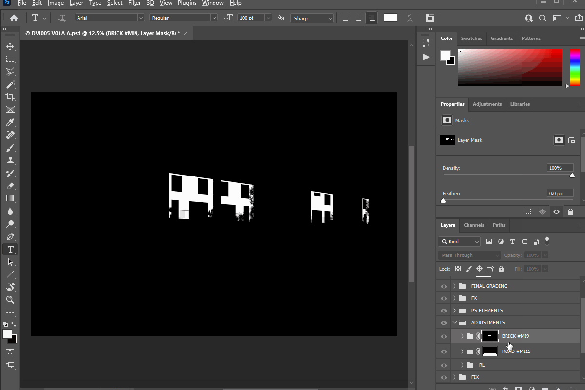

## SETUP
1) In photoshop, load the photoshop action saved in the src folder \src\PS_automated_file_setup.atn
2) Copy all the scripts from \links_to_copy into your Adobe Photoshop installation \Presets\Scripts (this is a shortcut to the original files so they can be updated centrally for all users).

---

## OVERVIEW

During a stint working at Scharp over the summer break, I noticed the process to create photoshop files (used to colour grade and manipulate rendered visulisation images) required a lot of repeative manual work and as such was time consuming. Additional to this, there were multiple other ineficancies that added to the overall time to deliver projects or lead to simple user errors. These issues were multiplied by the number of 3D Artiists that work on serveral images per day.

### Common Issues:
- Very time consuming to create multiple files.
- Time consuming to subsequently update for each draft change.
- Requiring a manual update to all adjustment masks when a render image is changed in the 3D model.
- Having to manualy update adjustment masks one by one.
- No ablity to upated draft letters for multiple files.

### Solution:
- Create or update multiple photoshop setups.
- Automated setups generated from render farm log files.
- Masks to be a "live link" to the corrispoding render element.
- Ablity to apply a mask code and update all masks in a few seconds.
- Batch update draft letters.

---

## 
## USING MASK CODES
- To add a mask to a folder in a photoshop file, use #<"code"> where the code corresponds to the render element you want to mask.

- Each code will start with MM or MI (MM for MultiMatte ID, MI for Material ID)
    - eg. #MI1 for Red channel MatID_Arch_123
    - #MM1 for Red channel MM_Arch_123

- Use a comma to select RG,RB,GB or RGB 
    - eg. #MM1,MM2,MM3 = RGB MM_Arch_123

- Use -I on the end of a tag to invert the mask
    - eg. #MM1-I

note: Folders to have a unique name eg. "Trees #MM28"
### Example:

Here a code is applied that matches to the corrisponding render elements produced from the 3D model.

Running the script to update all maks applies the alpha mask to all folders. 

Typically the photoshop files would have 10's of masks to update. This script saves a lot of time and reduces errors in the long run.

### Live Preview

---

## SCRIPT FILES
### PS_Automated_File_Setup_Module.jsx
    This is used as a library file and will not need to be loaded by the user.

### PS_Batch_Update_Draft_Letter.jsx
    Update Draft letters in photoshop files. eg. V01C -> V01C
    This can be done as a batch for multiple files at once.
    It can also be used to save out draft images.

### PS_Create_Files_Current_User_Only.jsx
    Create or update photoshop files from the current user log files that are generated when a render finishes.
    Best way to create files.
    Use with windows task schedule to automatically update your files that have rendered overnight, so they are ready first thing in the morning.

### PS_Create_Files_For_All_Users.jsx
    This will create photoshop files from the all user log files. (could be setup for a render machine to automatically update files on a regular interval)

### PS_Create_Files_Manual_Selection.jsx
    Create or update photoshop files by manually selecting the job folder and view numbers.

### PS_Update_All_Masks.jsx
    Update all masks based on the mask codes applied in that file. (see USING MASK CODES above)

### PS_Update_Selected_Mask_Only.jsx
    Update the selected folder mask based on the mask code applied. (see USING MASK CODES above)

---
